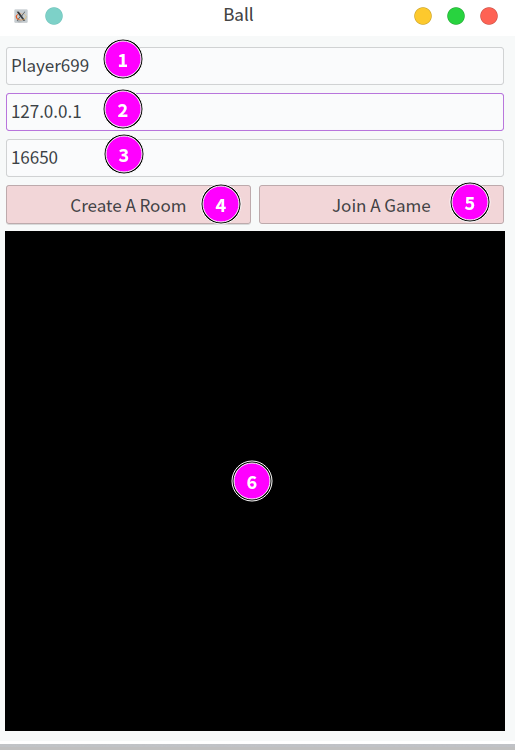

### Play Ball

#### How to build

you should have qt framework first.

```shell
mkdir build
cd build
cmake ..
make
```

#### How to play



1. your name
2. room's ip
3. room's port
4. create a room at your room's port
5. join a room to `[rooms's ip]:[room's  port]`

if no room there, you should create a room first, and join the room you created.

if you want join other's room, you shoud enter the exsit room's ip and port, and join direct, no need to create a new room.